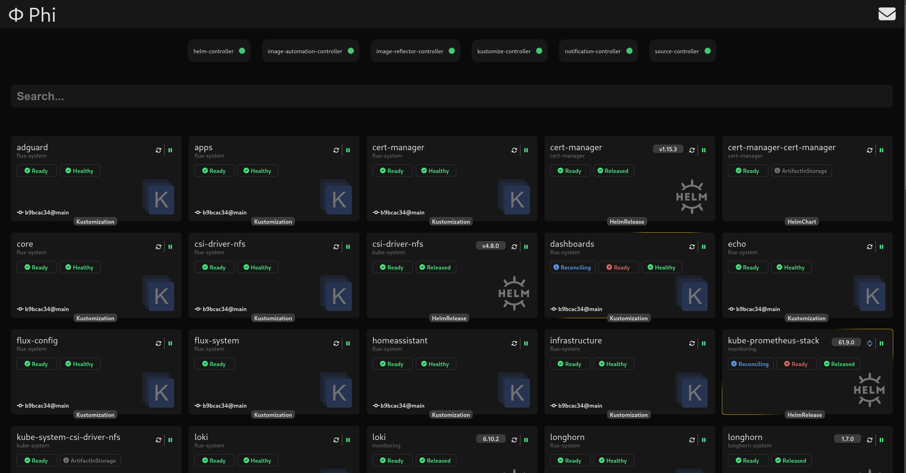
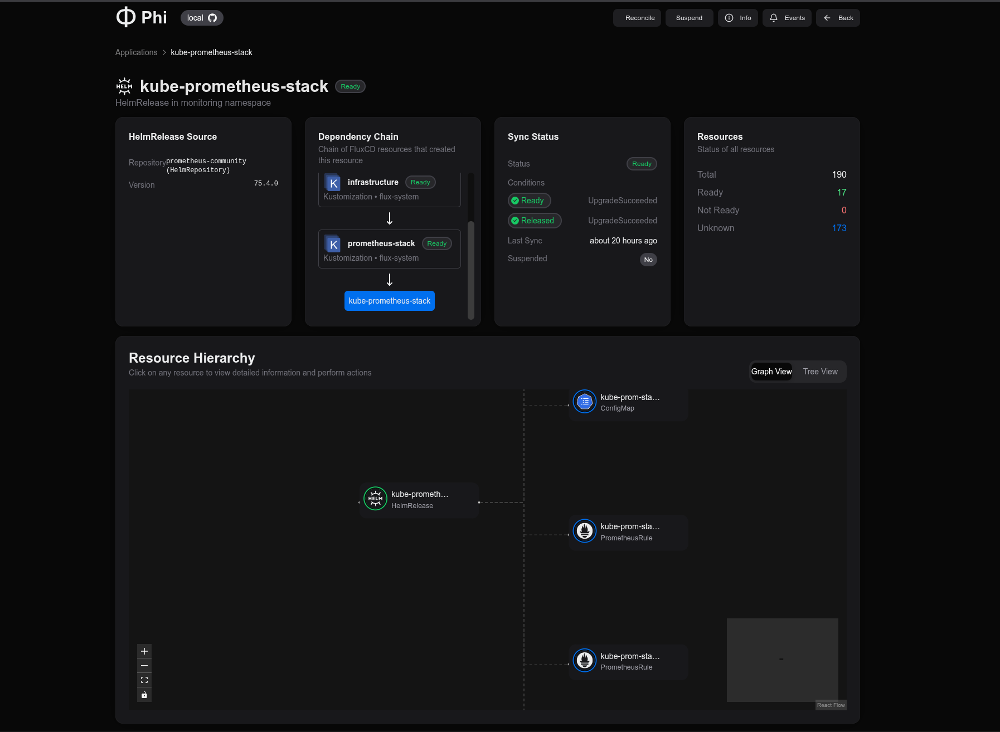

# Φ Phi

A dashboard / control plane for FluxCD _heavily_ inspired by [ArgoCD](https://argoproj.github.io/cd/)'s own dashboard.

This project began as a hands-on experiment with Go and over time, it transformed to this dashboard after some head bashing with flux and my homelab cluster.

__THIS IS NOT PRODUCTION READY__

I work on it when I have time and feel like it, focusing on what I need, so expect a many bugs, poorly tested, "works on my setup" type of thing (for now?).

# Features

- [X] Filter by Kind, Status, Suspended/Resumed
- [X] Show FluxCD version
- [X] Show FluxCD controllers status
- [X] Show all flux resources (kustomizations, helmreleases, ...) and their repositories
- [X] Show all resources created

  - [X] Show ANY resource that has a problem
- [X] Resource

  - [X] Show graph / tree view
  - [X] Show resources created count and status
  - [X] Show resources created count and status
  - [X] Show Sync Status
    - [X] Show conditions
  - [X] Show Depends On for kustomizations
  - [X] Show Dependency Chain for kustomizations
  - [X] Show repositories for Kustomizations and Helmreleases
  - [X] Manually reconcile
  - [X] Manually Suspend/Resume
  - [X] Show resource events
  - [X] Describe resource
  - [X] Show pod logs
- [X] Events

  - [X] Show Cluster Events
  - [X] Show FluxCD Events

# Backlog (for v1)

- [ ] Ability to filter events (regression)
- [ ] Add symbol in the UI to show resources about to be deleted and finalizers
- [ ] Handle more information which are resource specific (e.g. used space of a volume, TBD)
- [ ] Allow for some resource specific actions (e.g. delete a pod, TBD)
- [X] Code Cleanup
- [ ] Unit / Integration tests
- [X] Actual error handling in backend
- [ ] Resync backend periodically
- [X] Finish redesign

# Local Development

Prerequisites:

* go (1.22.6)
* node (20.15.1)
* yarn (1.22.22)
* mockery (2.53.3)

This repo also provides a `direnv` ready `flake.nix` for `NixOS` to setup the dependencies automatically in the shell (just `direnv allow`)

## Frontend

[See Frontend](./web/README.md)

## Backend

[See Backend](./backend/README.md)

### VSCode

Simply run the `Local Dev Suite`

# Acknowledgments

* [Capacitor](https://github.com/gimlet-io/capacitor) - As a source for learning how to interact with flux and kubernetes in go
* [xyflow/react](https://reactflow.dev/) - Great node diagram visualization library
* [kubectl-tree](https://github.com/ahmetb/kubectl-tree) - Kubectl plugin to explore ownership relationshipts between kubernetes objects. Some code was directly taken from this project
