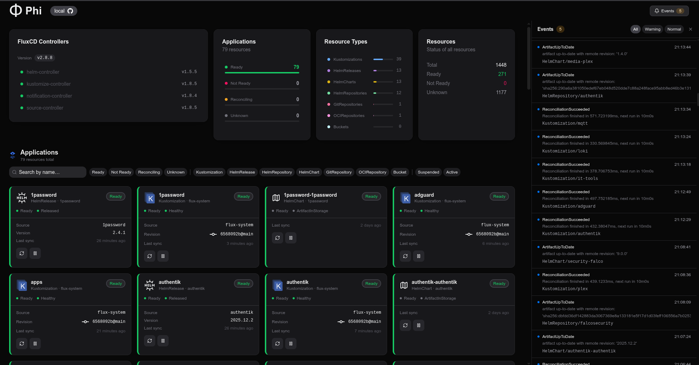
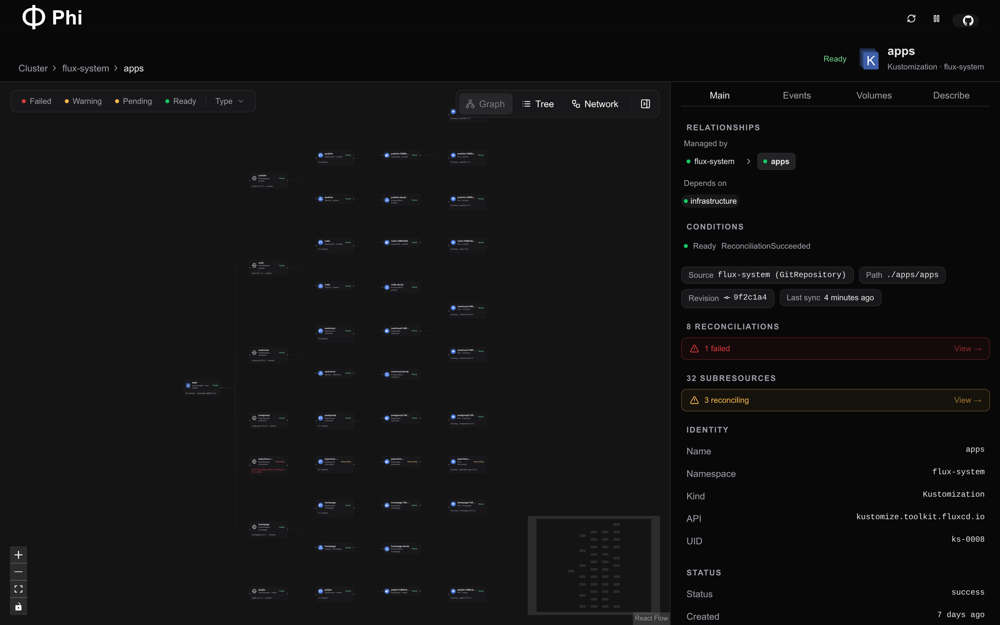
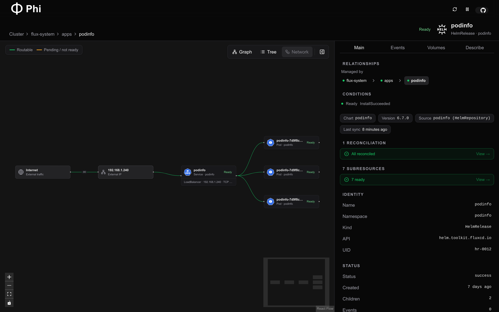
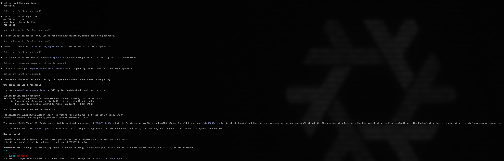
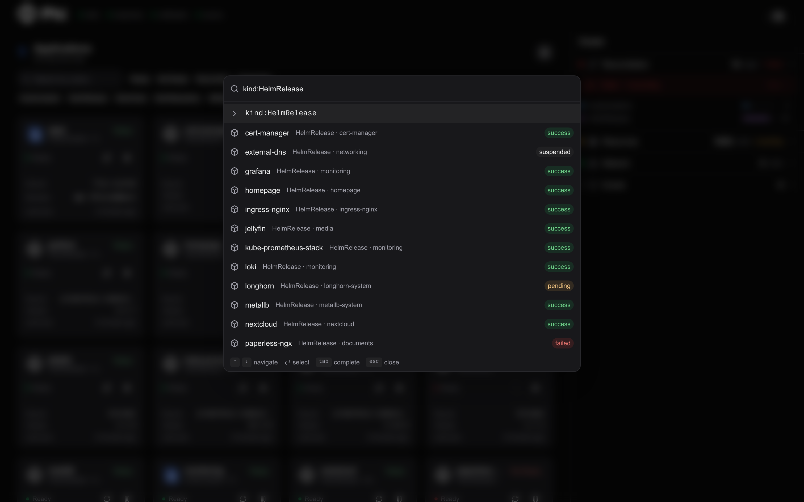
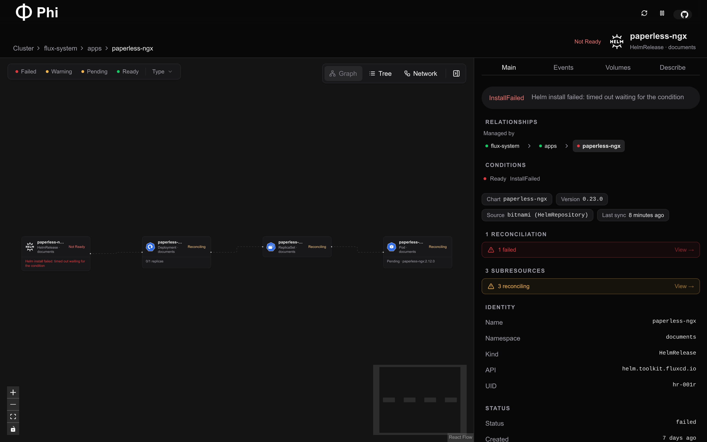

# Φ Phi

A dashboard / control plane for FluxCD _heavily_ inspired by [ArgoCD](https://argoproj.github.io/cd/)'s own dashboard.

This project began as a hands-on experiment with Go and over time, it transformed to this dashboard after some head bashing with flux and my homelab cluster.

__THIS IS NOT PRODUCTION READY__

I work on it when I have time and feel like it, focusing on what I need, so expect a many bugs, poorly tested, "works on my setup" type of thing (for now?).

Recently it has moved to an "agentic" supported development, since it does what I need it to do for my homelab, and I can focus my time on other projects.

<table>
  <tr>
    <td></td>
    <td></td>
  </tr>
  <tr>
    <td></td>
    <td></td>
  </tr>
  <tr>
    <td></td>
    <td></td>
  </tr>
</table>

## Features

- Check resource status
- Show resource dependencies
- Sync / Pause sync from UI
- Realtime logs per pod
- Highlight not ready resources immediately
- MCP server
- Show network graph, including TLS status & traefik integration
- Prometheus integration: show resource usage per pod and aggregate per kustomization, helmrelease
- Trivy integration: show vulnerabilities aggregated per kustomization or helmrelease
- Longhorn integration: show disk usage
- Command Palette - Find the resource you're looking for easily

## Local Development

Prerequisites:

- go (1.22.6)
- node (20.15.1)
- yarn (1.22.22)
- mockery (2.53.3)

This repo also provides a `direnv` ready `flake.nix` for `NixOS` to setup the dependencies automatically in the shell (just `direnv allow`)

### Frontend

[See Frontend](./web/README.md)

### Backend

[See Backend](./backend/README.md)

### VSCode

Simply run the `Local Dev Suite`

## Acknowledgments

- [Capacitor](https://github.com/gimlet-io/capacitor) - As a source for learning how to interact with flux and kubernetes in go
- [xyflow/react](https://reactflow.dev/) - Great node diagram visualization library
- [kubectl-tree](https://github.com/ahmetb/kubectl-tree) - Kubectl plugin to explore ownership relationshipts between kubernetes objects. Some code was directly taken from this project
