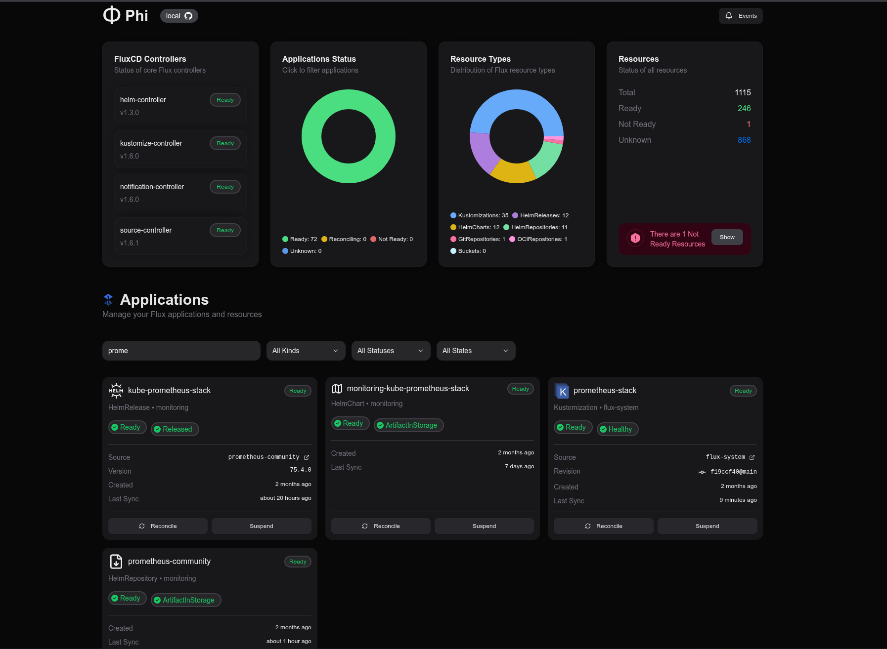

# Φ Phi

A dashboard for FluxCD _heavily_ inspired by [ArgoCD](https://argoproj.github.io/cd/).


This project began as a hands-on experiment with Go and over time, it transformed to this dashboard after some head bashing with flux and my homelab cluster.

This works for my cluster and my setup, however it may struggle with other configurations and versions...


__THIS IS NOT PRODUCTION READY__

If you want to try it out beware: many bugs are to be expected.
Code is not optimized, nor fully tested.





# Features
- [x] Show sync status
- [x] Show conditions
- [x] Show ownership tree
- [x] Manually sync
- [x] Manually Suspend/Resume sync
- [x] Show object events and all events
- [x] Show Pod logs

# Development

Prerequisites:
* go (1.22.6)
* node (20.15.1)
* yarn (1.22.22)

## Frontend
```
cd web
yarn
```

## Backend
```
cd backend
go mod tidy
go mod download
```

### VSCode
Simply run the `Local Dev Suite`


# Acknowledgments

* [Capacitor](https://github.com/gimlet-io/capacitor) - As a source for learning how to interact with flux and kubernetes in go
* [xyflow/react](https://reactflow.dev/) - Great node diagram visualization library
* [kubectl-tree](https://github.com/ahmetb/kubectl-tree) - Kubectl plugin to explore ownership relationshipts between kubernetes objects. Some code was directly taken from this project
